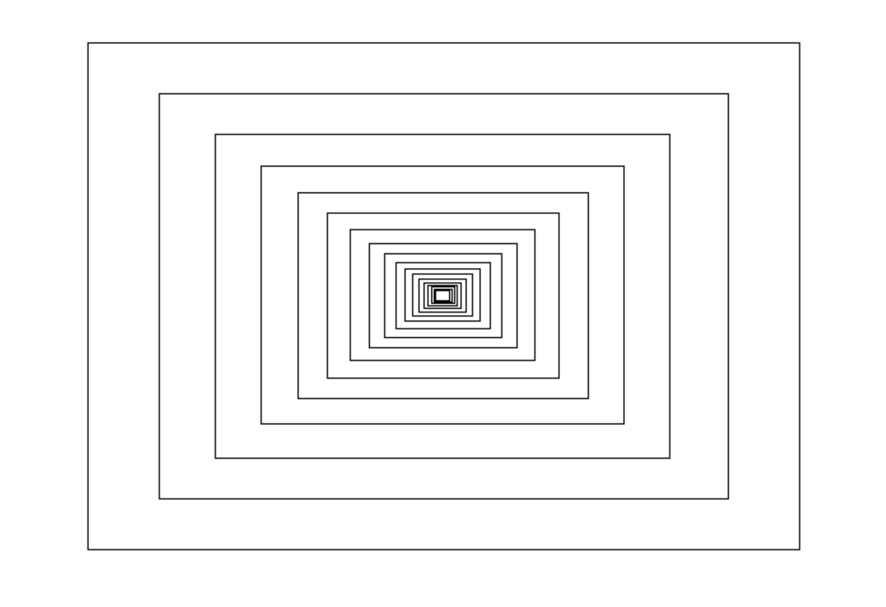
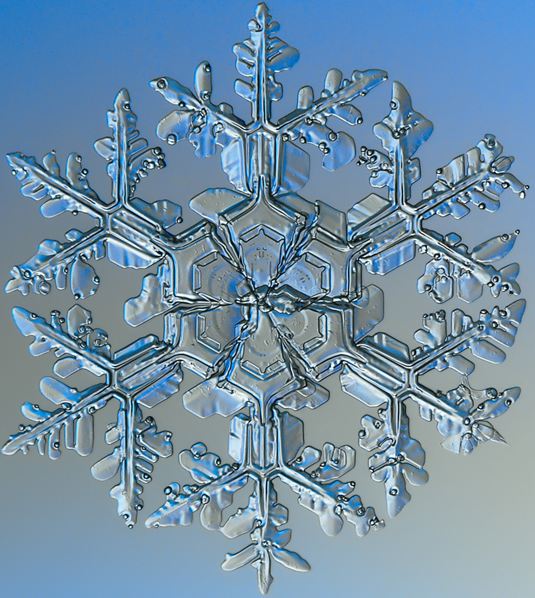
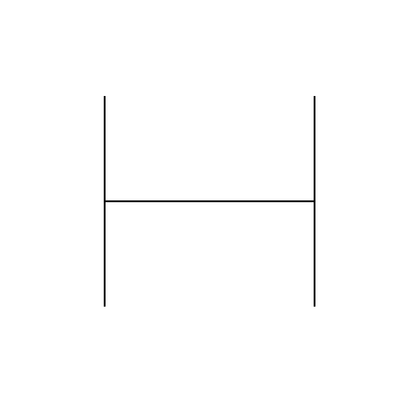
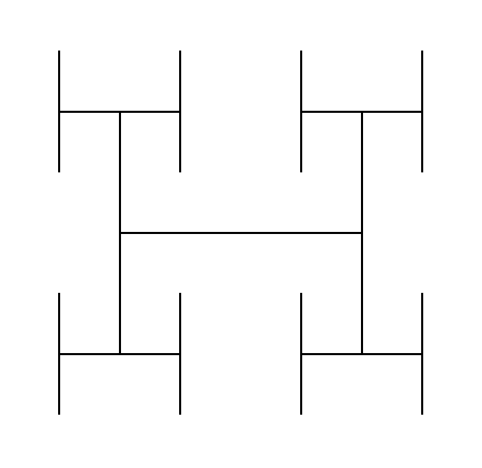
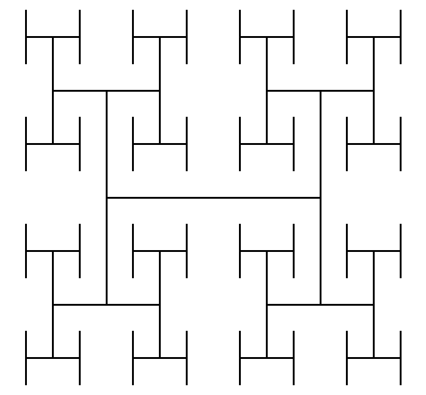

## Algemeen
Deze ReadMe bevat info over opdracht 4 & 6.

### Opdracht 4: recursieve rechthoeken
Het is mogelijk om recursie te visualiseren. We zullen hiervoor pygame gebruiken. Ga naar `opdracht4.py` en voltooi de functie `recursieve_rechthoek`. Deze functie wordt in de voltooide functie `main` gebruikt om steeds kleinere rechthoeken op het scherm te tekenen.

De grootte & positie van de rechthoeken moeten als volgt veranderen.
* `grootte`: iedere rechthoek moet 0.8 keer zo hoog en breed zijn als de vorige.
* `positie`: verhoog de `x-coordinaat` met 10% van de breedte en `y-coordinaat` met 10% van de hoogte (VB: x = x + 0.1*breedte). 

De functie `recursief tekenen` moet stoppen als de breedte of de hoogte van de rechthoek kleiner is dan 10. De functie moet (ongeveer) volgend resultaat geven.
<p align="center">
  
</p>

### Opdracht 6 - Fractalen
Een fractaal is een geometrische figuur, met patronen die zich herhalen op verschillende schalen. Denk bijvoorbeeld aan een sneeuwvlok.

<p align="center">
  
</p>

Omwille van de herhaling, kan je fractalen best recursief tekenen. We zullen dit aantonen in pygame. Voltooi de functie `recursieve_fractaal` in `opdracht6.py`. Deze functie wordt in de voltooide functie `main` gebruikt om een fractaal met een bepaalde **diepte** te tekenen. Het patroon zal zich een aantal keer herhalen gelijk aan deze **diepte**.

De recursie moet stoppen wanneer het een **diepte** van 0 bereikt heeft. Onderstaande figuur toont het resultaat met een **diepte** van respectievelijk 1, 2 en 3.

<style>
  .figure-container {
    display: flex;
    justify-content: center;
  }

  .figure {
    margin: 0 10px;
    text-align: center;
  }
</style>

<div class="figure-container">
  <figure class="figure">
    
    <figcaption>Diepte = 1</figcaption>
  </figure>
  <figure class="figure">
    
    <figcaption>Diepte = 2</figcaption>
  </figure>
  <figure class="figure">
    
    <figcaption>Diepte = 3</figcaption>
  </figure>
</div>

`opdracht6.py` bevat ook een functie `teken_h`. Je kan deze oproepen om bovenstaande **H**'s te tekenen op een bepaalde x- en y-coordinaat & met een bepaalde breedte en hoogte.

```
teken_h(x, y, breedte, hoogte, scherm)
```

### Tip
Zoals je ziet bestaat diepte 2 uit de H van diepte 1 (de H in het midden). Op de 4 uiteindes zijn er echter nieuwe, kleinere, H's getekend. De positie en grootte van deze kleinere H's zijn...

```
H_diepte1     = x           , y          , breedte   , hoogte

H_linksboven  = x           , y          , breedte//2, hoogte//2
H_rechtsboven = x+breedte//2, y          , breedte//2, hoogte//2
H_linksonder  = x           , y+hoogte//2, breedte//2, hoogte//2
H_rechtsonder = x+breedte//2, y+hoogte//2, breedte//2, hoogte//2
```